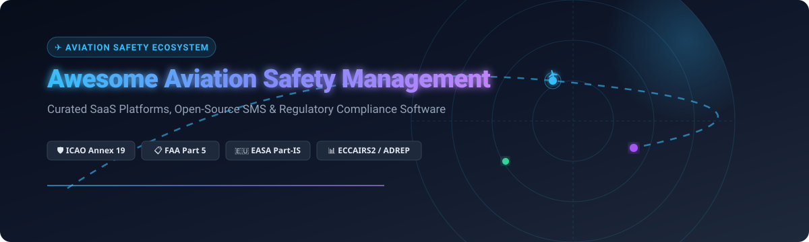

  

  
  
  
  
  
  
  

# ✈️ Awesome Aviation Safety Management System (SMS) Ecosystem

**Curated List of SaaS Platforms & Open-Source GitHub Projects for Aviation Safety, Risk Management, and Regulatory Compliance**

*Comprehensive guide for Airlines, Airports, MROs, Air Traffic Control (ATC), UAS/Drone Operators, and Aviation Regulators.*

---

## 📌 Executive Overview

An **Aviation Safety Management System (SMS)** is an organized, systematic approach to managing safety, including the necessary organizational structures, accountabilities, policies, and procedures. As mandated by international regulations—including **ICAO Annex 19**, **FAA 14 CFR Part 5**, and **EASA Regulation (EU) 2023/2034 (Part-IS)**—aviation organizations must establish formal safety reporting, hazard identification, Bowtie risk assessment, and Flight Operational Quality Assurance (FOQA) / Flight Data Analysis (FDA) workflows.

This repository tracks the leading commercial SaaS platforms, enterprise EHS solutions, and open-source software powering modern data-driven aviation safety operations.

---

## 📋 Table of Contents

- [🌐 SaaS / Hosted Platforms](#-saas--hosted-platforms)
- [🔓 Open-Source GitHub Projects](#-open-source-github-projects)
- [🔍 Open Aviation Safety Taxonomies & Data Standards](#-open-aviation-safety-taxonomies--data-standards)
- [🤝 How to Contribute](#-how-to-contribute)
- [⚠️ Regulatory & Safety Disclaimer](#%EF%B8%8F-regulatory--safety-disclaimer)
- [📈 Star History](#-star-history)
- [💖 Support & Community](#-support--community)

---

## 🌐 SaaS / Hosted Platforms

> 📊 **Market Insights**: The global Aviation Safety Management System (SMS) software market is estimated at approximately **$2.8 billion to $3.0 billion**, growing at a CAGR of ~7.4%. The sector is **moderately to highly fragmented**, characterized by a combination of large enterprise EHS conglomerates, aerospace system integrators, and specialized niche aviation SMS platforms.

| Product Name | Description & Key Features | Pricing (Starting Tier) | Free Tier / Free Trial Limits | Company Size (Valuation / Revenue) |
| :--- | :--- | :--- | :--- | :--- |
| **[Intelex Aviation](https://www.intelex.com/)** | Enterprise EHS and safety management software serving global aviation and aerospace organizations. | $49.00 / user / month (min 25 users base) | 14-day free trial (up to 5 test user accounts & sandbox data) | ~$25.0B Valuation ($6.0B Annual Revenue, Parent: Fortive) |
| **[SafetyLine](https://www.safetyline.com/)** | Aviation safety management platform for safety reporting, risk management, and regulatory compliance. | $500 / month (base operational tier) | 30-day sandbox trial (limited to 3 aircraft & 5 users) | ~$3.0B Valuation ($1.5B Annual Revenue, Parent: SITA) |
| **[Ideagen Coruson](https://www.ideagen.com/products/coruson/)** | Enterprise cloud software for complete control and real-time reporting of safety and operational risk across tier-one airlines. | $1,500 / month (base subscription tier) | 14-day guided trial (demo organization scope, single admin account) | ~$1.3B Valuation ($180M Annual Revenue, Parent: Ideagen Ltd) |
| **[Qualtrax](https://www.qualtrax.com/)** | Compliance and quality management software with aviation SMS capabilities and document control. | $450 / month (base tier up to 10 users) | 14-day full access evaluation environment (max 5 user accounts) | ~$1.3B Valuation ($180M Annual Revenue, Parent: Ideagen Ltd) |
| **[AQD](https://www.aqd.com/)** | Aviation quality and safety management software for compliance monitoring, audit management, and occurrence reporting. | $800 / month (base module license) | 14-day evaluation demo (pre-configured safety database, 2 test accounts) | ~$1.3B Valuation ($180M Annual Revenue, Parent: Ideagen Ltd) |
| **[Baines Simmons Centrik](https://www.bainessimmons.com/)** | Safety, quality, and compliance management platform designed for aviation operators of all sizes. | £350 / month (~$450/mo base plan) | 30-day full SMS module trial (up to 5 users) | ~$300M Valuation ($850M Annual Revenue, Parent: Wheels Up) |
| **[Comply365](https://www.comply365.com/)** | Aviation compliance and safety management platform with mobile-first design for operational efficiency. | $1,200 / month (base operational subscription) | 14-day evaluation environment (up to 10 test credentials) | ~$350M Valuation ($60M Annual Revenue, Parent: Comply365/Vistair Group) |
| **[Vistair SafetyNet](https://www.vistair.com/)** | Aviation safety reporting system driving real change in occurrence investigation with offline mobile capabilities. | $1,000 / month (base tier for regional operators) | 14-day evaluation trial (limited to 5 user logins & sample flight schedules) | ~$350M Valuation ($60M Annual Revenue, Parent: Comply365/Vistair Group) |
| **[ASQS](https://www.asqs.aero/)** | Aviation safety and quality management solutions (iQSMS) including hazard registers and risk assessments. | €400 / month (~$440/mo basic SMS package) | 30-day full test instance (up to 5 user seats & 2 aircraft) | ~$60M Valuation ($15M Annual Revenue, ASQS GmbH) |
| **[Yonder SMS](https://www.yondersms.com/)** | Cloud-based safety management system for airlines, airports, and aviation service providers. | €250 / month (~$275/mo entry tier) | 30-day free trial (up to 10 users & 50MB document storage) | ~$20M Valuation ($5M Annual Revenue, Yonder Mind AG) |
| **[GfL Safety Management System](https://www.gfl-consult.de/en/software/safety_tools/airport_sms)** | Web-based SMS tool fulfilling EU Regulation 139/2014 & ADR.OR.D.005 with ECCAIRS2 integration. | €300 / month (~$330/mo airport license) | 14-day test environment (1 airport station, 3 test users) | ~$10M Valuation ($3M Annual Revenue, GfL Consult GmbH) |
| **[GfL Occurrence Reporting System (ORS)](https://www.gfl-consult.de/en/software/safety_tools/airport_ors)** | Reporting system for smaller airports with ECCAIRS2 integration and anonymous reporting support. | €150 / month (~$165/mo small airport package) | 14-day test environment (1 form template, 3 user seats) | ~$10M Valuation ($3M Annual Revenue, GfL Consult GmbH) |
| **[SafeJets MS](https://www.safejets.net/)** | Aviation safety, quality, and compliance platform for Part 135 operators with Bowtie risk assessment & AI risk analysis. | $199 / month (base plan for Part 135 operators) | 14-day free trial (up to 3 aircraft & 5 user accounts) | ~$8M Valuation ($2M Annual Revenue, SafeJets LLC) |

---

## 🔓 Open-Source GitHub Projects

*Sorted by GitHub Star Count (Descending)*

- **[ArduPilot](https://github.com/ArduPilot/ardupilot)**   
  Leading open-source autopilot software system providing advanced flight safety interlocks, failsafe routines, geo-fencing, and emergency recovery algorithms for uncrewed aerial vehicles (UAVs) and aircraft.

- **[PX4 Autopilot](https://github.com/PX4/PX4-Autopilot)**   
  Open-source flight control system for autonomous aircraft featuring safety-critical state estimation, automated failover triggers, obstacle avoidance, and hardware-in-the-loop (HITL) safety testing.

- **[FlightGear](https://github.com/flightgear/flightgear)**   
  Sophisticated open-source flight simulator framework used extensively in research, pilot training, flight dynamics modeling, and failure mode safety analysis.

- **[traffic](https://github.com/traffic-viz/traffic)**   
  Python library for processing air traffic control (ATC) trajectories and ADS-B data, widely used for flight safety monitoring, airspace risk assessment, and conflict detection research.

- **[pyOpenSky](https://github.com/OpenSky-Network/pyopensky)**   
  Python API for accessing the OpenSky Network's global ADS-B and Mode-S air traffic database, enabling empirical aviation occurrence and airspace safety research.

- **[SeparationEngine](https://github.com/roxanneardary/SeparationEngine)**   
  Open-source airspace computation platform licensed under AGPL 3.0+ that transforms aviation safety from reactive control to predictive assurance using physics-based trajectory simulation and explainable AI.

- **[OpenCert](https://github.com/eclipse/opencert)**   
  Open-source tool framework supporting modeling of safety standards and regulatory compliance (DO-178C, DO-254, ISO 26262), assurance project lifecycle tracking, and safety-case modeling.

- **[OPENCOSS](https://github.com/eclipse-sisu/opencoss)**   
  Open-source platform for evolutionary assurance and certification of safety-critical aerospace systems based on the Common Certification Language (CCL) extending OMG SACM.

- **[OpenDroneSMS](https://github.com/gearboxxsv/OPENDroneSMS)**   
  Anonymous Safety Reporting System (ASRS) for the Unmanned Aircraft Safety Team (UAST). Foundation for custom drone safety management programs prioritizing privacy and data sharing.

- **[ADREP Taxonomy Schemas](https://github.com/easa/adrep-taxonomy)**   
  Open data schemas and mappings for the ICAO ADREP taxonomy and EASA ECCAIRS2 occurrence reporting framework used across European aviation safety databases.

- **[TCAS System Simulation](https://github.com/muzammilmalik01/tcas-system)**   
  Implementation of Traffic Collision Avoidance System (TCAS II) Resolution Advisories (RA) and Traffic Advisories (TA) logic for safety research and educational analysis.

- **[Aviation Accidents Data](https://github.com/lhehnke/aviation-accidents-data)**   
  Scraper and curated dataset for Aviation Safety Network (ASN) and NTSB incident reports, facilitating empirical aviation safety and accident trend research.

---

## 🔍 Open Aviation Safety Taxonomies & Data Standards

- **[ECCAIRS 2 (European Co-ordination Centre for Aviation Incident Reporting Systems)](https://eccairs2.easa.europa.eu/)** — The official European Union aviation occurrence reporting digital platform aligned with Regulation (EU) No 376/2014 and the ICAO ADREP taxonomy.
- **[ICAO ADREP Taxonomy](https://www.icao.int/safety/air-navigation/Pages/adrep-taxonomies.aspx)** — The global standard taxonomy maintained by ICAO for categorizing aviation occurrences, risk events, aircraft types, and causal factors.
- **[FAA ASRS (Aviation Safety Reporting System)](https://asrs.arc.nasa.gov/)** — NASA-administered confidential reporting database providing empirical safety occurrence data for research and safety analysis.

---

## 🤝 How to Contribute

1. Fork this repository.
2. Add your SaaS product or open-source tool to `README.md` following the existing format.
3. Ensure open-source projects include a valid GitHub link and star badge link.
4. Open a Pull Request (PR) with a brief summary of the proposed changes.

---

## ⚠️ Regulatory & Safety Disclaimer

- This repository is a **community-curated index** for informational and educational purposes.
- Enterprise deployment of any aviation SMS software must comply with applicable regulatory authorities, including **ICAO Annex 19**, **FAA 14 CFR Part 5**, **EASA Part-IS / Part-145 / Part-ORO**, and national civil aviation guidelines (CAA).
- Self-hosted open-source software must undergo rigorous aviation-grade security, data integrity, and operational validation prior to operational deployment.

---

## 📈 Star History

---

## 💖 Support & Community

Thank you for exploring **Awesome Aviation Safety Management**! If this repository helped your airline, airport, research team, or software project, please consider supporting the project:

- ⭐ **Star this repository** to help other aviation safety professionals find it.
- 🔀 **Fork and Contribute** to help keep the ecosystem updated with the latest tools.
- 📢 **Share with your colleagues** across flight operations, safety engineering, and compliance management.
- ☕ **Sponsor the Project**: Support ongoing maintenance via [GitHub Sponsors](https://github.com/sponsors/ishandutta2007).
